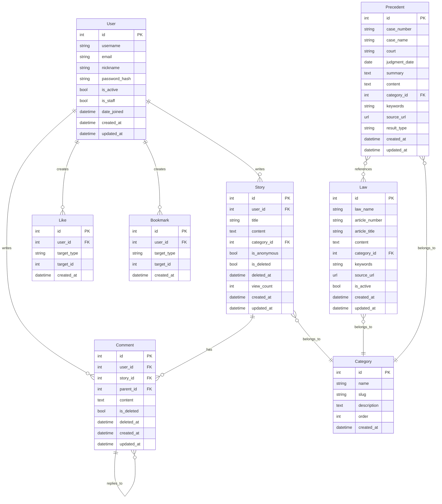

# 데이터 모델 (ERD)

3차 단계 모델. 도메인 책임으로 5개 앱에 분산.

## Mermaid 다이어그램

## 핵심 관계

| 관계 | 카디널리티 | on_delete | 비고 |
|------|----------|-----------|------|
| User → Story.user | 1:N | SET_NULL | 탈퇴 회원 사연은 "탈퇴 회원"으로 표시 |
| User → Comment.user | 1:N | SET_NULL | 동일 |
| User → Like.user | 1:N | CASCADE | 사용자 삭제 시 좋아요도 삭제 |
| User → Bookmark.user | 1:N | CASCADE | 동일 |
| Category → Story.category | 1:N | PROTECT | 카테고리 삭제 시 사연 보호 (삭제 차단) |
| Category → Law.category, Precedent.category | 1:N | SET_NULL | nullable |
| Story → Comment.story | 1:N | CASCADE | 사연 hard delete 시 댓글도 삭제 |
| Comment → Comment.parent | self-FK | CASCADE | 부모 hard delete 시 대댓글 삭제 (1단계만) |
| Precedent ↔ Law | M:N | through related_laws | 한 판례가 여러 법령 인용 |

## Soft Delete

`Story`, `Comment`에 `is_deleted` + `deleted_at` 컬럼.
- 기본 manager (`objects`)는 `is_deleted=False`만 노출
- `all_objects`는 전체 (admin/관리자용)

## 인덱스

- Story: `[-created_at]` 순서, `category` 필터, `view_count` 정렬
- Comment: `(story, created_at)` 합성 인덱스, `parent` 인덱스
- Law: `law_name` 인덱스, `category` 인덱스, `(law_name, article_number)` unique
- Precedent: `(court, -judgment_date)` 합성 인덱스, `category` 인덱스, `(case_number, court)` unique
- Like / Bookmark: `(user, target_type, target_id)` unique, `(target_type, target_id)` 인덱스
